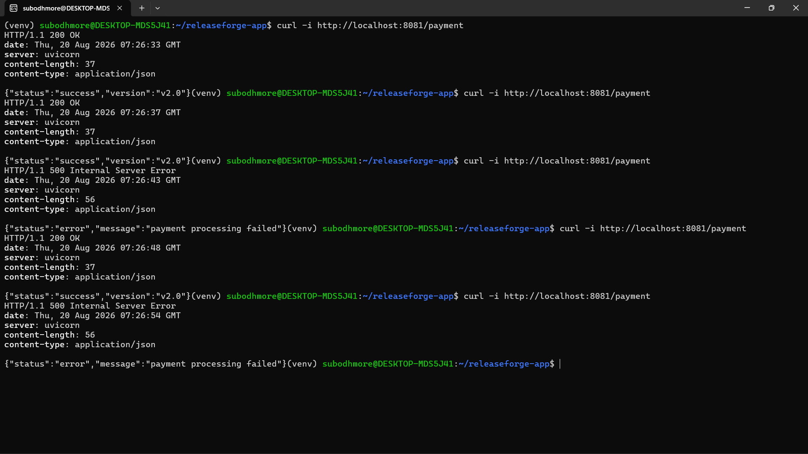
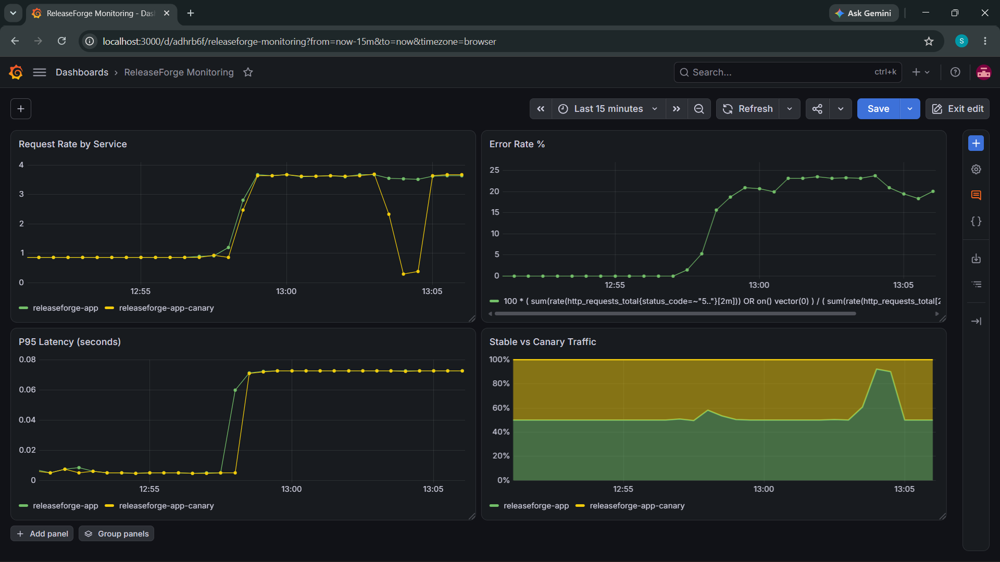
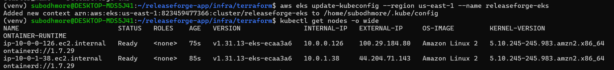

# Progressive Application Delivery Platform

A production-oriented GitOps and progressive delivery platform that automates the application release lifecycle — from code commit and security scanning to Kubernetes deployment, canary analysis, observability, promotion, and automated rollback.

The platform treats every new application version as an **unproven release**. Instead of immediately sending 100% of production traffic to a new version, it gradually exposes the release to users while continuously evaluating real application metrics.

If the release is healthy, traffic is progressively increased.

If the release fails the defined health criteria, the platform automatically aborts the deployment and restores the stable version without manual intervention.

## What this demonstrates

* **CI/CD** — automated testing, linting, container builds, and vulnerability scanning
* **Container security** — Trivy-based vulnerability scanning before deployment
* **GitOps** — Git as the source of truth for Kubernetes desired state
* **Progressive delivery** — controlled canary releases using weighted HTTP traffic
* **Automated release analysis** — Prometheus metrics used to evaluate application health
* **Automated rollback** — failed analysis automatically aborts the canary release
* **Observability** — Prometheus metrics and Grafana dashboards for release monitoring
* **Infrastructure as Code** — AWS infrastructure provisioned using Terraform
* **Cloud-native deployment** — application deployed and verified on Amazon EKS

---

## Architecture

```text
Developer
    │
    │ git push
    ▼
 GitHub
    │
    ▼
GitHub Actions
    │
    ├── Tests
    ├── Lint
    ├── Docker Build
    └── Trivy Scan
           │
           ▼
      Docker Registry
           │
           ▼
    GitOps Manifest
           │
           ▼
        Argo CD
           │
           ▼
      Kubernetes
           │
           ▼
    Argo Rollouts
       │         │
       ▼         ▼
    Stable     Canary
       │         │
       └────┬────┘
            ▼
      NGINX Ingress
            │
            ▼
          Users
            │
            ▼
       Application
         Metrics
            │
            ▼
       Prometheus
            │
       ┌────┴────┐
       ▼         ▼
    Healthy    Failed
       │         │
       ▼         ▼
    Promote   Rollback
```

---

## Progressive Delivery

The platform uses Argo Rollouts to gradually introduce a new application version.

Example traffic progression:

```text
Stable    Canary
  90%       10%
     │
     ▼
   Analysis
     │
     ▼
Stable    Canary
  75%       25%
     │
     ▼
   Analysis
     │
     ▼
Stable    Canary
  50%       50%
     │
     ▼
   Analysis
     │
     ▼
Stable    Canary
   0%      100%
```

Traffic is controlled at the HTTP level using NGINX Ingress weighted canary routing rather than relying on pod-count approximation.

### Canary Failure Test

A simulated application failure was introduced during a canary deployment to verify that the platform could detect unhealthy behavior through real HTTP responses.

The test demonstrated successful responses followed by HTTP 500 errors and subsequent recovery:



*Simulated canary failure producing HTTP 500 responses during progressive delivery testing.*

---

## Automated Rollback

During a canary deployment, application metrics are continuously evaluated using Prometheus and Argo Rollouts.

The primary signals include:

* HTTP error rate
* P95 request latency
* Application request rate
* Stable vs. canary traffic distribution

The decision process is:

```text
New Version
     │
     ▼
Deploy Canary
     │
     ▼
Send Controlled Traffic
     │
     ▼
Collect Prometheus Metrics
     │
     ▼
Automated Analysis
     │
 ┌───┴────┐
 ▼        ▼
Healthy  Failed
 │        │
 ▼        ▼
Continue  Abort Rollout
             │
             ▼
        Restore Stable
```

A simulated production failure was used to verify the complete rollback mechanism. The Prometheus error-rate analysis failed, causing Argo Rollouts to automatically abort the rollout and return traffic to the stable version.

---

## Observability

The monitoring stack consists of:

* **Prometheus** — application metrics collection and release analysis
* **Grafana** — visualization and operational monitoring
* **prometheus_client** — custom application instrumentation

The Grafana dashboard contains:

* **Request Rate by Service**
* **Error Rate %**
* **P95 Latency**
* **Stable vs Canary Traffic**

### Progressive Delivery Monitoring Dashboard

The dashboard provides a real-time view of application behavior and traffic distribution between the stable and canary versions.



*Grafana dashboard showing request rate, error rate, P95 latency, and stable-versus-canary traffic.*

---

## CI/CD Pipeline

```text
Git Push
   │
   ▼
GitHub Actions
   │
   ├── Tests
   ├── Lint
   ├── Docker Build
   ├── Trivy Security Scan
   └── Push Image
          │
          ▼
     Docker Registry
          │
          ▼
    GitOps Configuration
```

The CI pipeline was also verified against real dependency vulnerabilities. HIGH/CRITICAL vulnerabilities were detected during development and required dependency updates before the release could proceed.

---

## GitOps

Git acts as the desired-state source for the Kubernetes environment.

```text
Git Repository
      │
      ▼
    Argo CD
      │
      ▼
Kubernetes Desired State
      │
      ▼
Actual Cluster State
```

GitOps drift correction was verified by manually changing the Kubernetes deployment state and observing Argo CD reconcile the cluster back to the state defined in Git.

---

## Technology Stack

| Layer                       | Technology        |
| --------------------------- | ----------------- |
| Application                 | Python / FastAPI  |
| Testing                     | Pytest            |
| CI/CD                       | GitHub Actions    |
| Containerization            | Docker            |
| Container Security          | Trivy             |
| Container Registry          | Docker Hub        |
| Kubernetes                  | Kubernetes        |
| Local Kubernetes            | kind              |
| GitOps                      | Argo CD           |
| Progressive Delivery        | Argo Rollouts     |
| Traffic Management          | NGINX Ingress     |
| Metrics                     | Prometheus        |
| Application Instrumentation | prometheus_client |
| Monitoring                  | Grafana           |
| Infrastructure as Code      | Terraform         |
| Cloud                       | AWS               |
| Managed Kubernetes          | Amazon EKS        |

---

## AWS EKS Deployment

The platform was deployed and verified on a real Amazon EKS cluster provisioned using Terraform.

```text
AWS
 │
 └── Amazon EKS
      │
      └── EC2 Worker Nodes
            │
            └── Application
                 │
                 ├── Stable
                 └── Canary
```

### Terraform Provisioning and EKS Verification

The infrastructure was provisioned using Terraform and verified using the AWS CLI and `kubectl`.



*Terraform successfully provisioned the EKS infrastructure and the worker nodes were verified as Ready.*

Cluster verification:

```bash
aws eks update-kubeconfig \
  --region us-east-1 \
  --name releaseforge-eks

kubectl get nodes -o wide
```

The EKS cluster successfully reported ready worker nodes and the application was verified running on the provisioned infrastructure.

---

## Infrastructure as Code

AWS infrastructure is managed using Terraform:

```bash
cd infra/terraform

terraform init
terraform plan
terraform apply
```

After verification, the infrastructure can be removed with:

```bash
terraform destroy
```

The infrastructure was destroyed after testing to avoid unnecessary AWS costs.

---

## Local Development

### Requirements

* Python 3
* Docker
* kubectl
* kind
* Helm
* Argo Rollouts kubectl plugin

### Run the application

```bash
python3 -m venv venv
source venv/bin/activate

pip install -r requirements.txt

uvicorn app.main:app --reload
```

### Run tests

```bash
python -m pytest tests/ -v
```

### Build Docker image

```bash
docker build -t releaseforge-app:local .
```

### Run container

```bash
docker run -p 8000:8000 releaseforge-app:local
```

---

## Local Kubernetes Deployment

Create a local cluster:

```bash
kind create cluster --name releaseforge
```

Install Argo CD:

```bash
kubectl create namespace argocd

kubectl apply \
  -n argocd \
  -f https://raw.githubusercontent.com/argoproj/argo-cd/stable/manifests/install.yaml
```

Install Argo Rollouts:

```bash
kubectl create namespace argo-rollouts

kubectl apply \
  -n argo-rollouts \
  -f https://github.com/argoproj/argo-rollouts/releases/latest/download/install.yaml
```

Install NGINX Ingress:

```bash
kubectl apply \
  -f https://raw.githubusercontent.com/kubernetes/ingress-nginx/main/deploy/static/provider/kind/deploy.yaml
```

Install Prometheus and Grafana:

```bash
helm repo add prometheus-community \
  https://prometheus-community.github.io/helm-charts

kubectl create namespace monitoring

helm install monitoring \
  prometheus-community/kube-prometheus-stack \
  -n monitoring
```

Deploy the Argo CD application:

```bash
kubectl apply -f infra/argocd/application.yaml
```

---

## Repository Structure

```text
progressive-application-delivery-platform/
│
├── app/
│   └── main.py
│
├── tests/
│   └── ...
│
├── infra/
│   │
│   ├── argocd/
│   │   └── application.yaml
│   │
│   ├── environments/
│   │   └── dev/
│   │       ├── rollout.yaml
│   │       ├── service.yaml
│   │       ├── ingress.yaml
│   │       ├── servicemonitor.yaml
│   │       └── analysis-template.yaml
│   │
│   └── terraform/
│       ├── main.tf
│       ├── variables.tf
│       ├── outputs.tf
│       └── ...
│
├── .github/
│   └── workflows/
│       └── ci.yml
│
├── docs/
│   └── screenshots/
│       ├── grafana-progressive-delivery.png
│       ├── canary-failure-test.png
│       └── aws-eks-deployment.png
│
├── Dockerfile
├── requirements.txt
└── README.md
```

---

## Verification

The major platform capabilities were executed and verified:

| Capability         | Verification                                    |
| ------------------ | ----------------------------------------------- |
| CI/CD              | GitHub Actions pipeline executed                |
| Container build    | Docker image successfully built                 |
| Security scanning  | Trivy detected real dependency vulnerabilities  |
| GitOps             | Argo CD reconciled manually introduced drift    |
| Canary deployment  | Stable and canary workloads ran simultaneously  |
| Weighted traffic   | NGINX canary weights changed progressively      |
| Prometheus         | Application metrics collected successfully      |
| Grafana            | Release metrics visualized in dashboard         |
| Automated analysis | Argo Rollouts evaluated Prometheus metrics      |
| Automated rollback | Failed analysis triggered rollout abort         |
| AWS deployment     | Application deployed on real EKS infrastructure |
| Terraform          | EKS infrastructure provisioned through IaC      |

---

## Key Engineering Concepts

This project demonstrates practical implementation of:

* CI/CD
* Docker containerization
* Kubernetes
* GitOps
* Argo CD
* Progressive delivery
* Canary deployments
* Weighted traffic routing
* Prometheus monitoring
* Grafana observability
* Automated release analysis
* Automated rollback
* Infrastructure as Code
* AWS EKS

---

## Project Outcome

The platform implements a complete progressive application delivery workflow:

```text
Code
 ↓
CI/CD
 ↓
Security Scan
 ↓
Container Registry
 ↓
GitOps
 ↓
Kubernetes
 ↓
Canary Deployment
 ↓
Controlled Traffic
 ↓
Prometheus Metrics
 ↓
Automated Analysis
 ↓
Promote OR Rollback
```

The core principle is:

> **Deploy gradually, measure continuously, and automatically stop unhealthy releases.**
